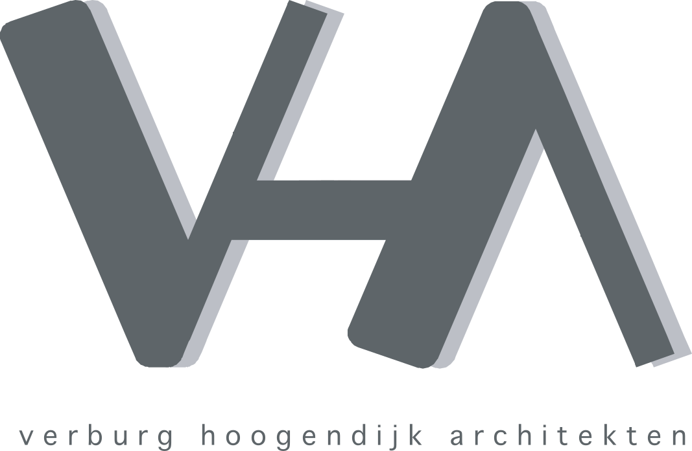
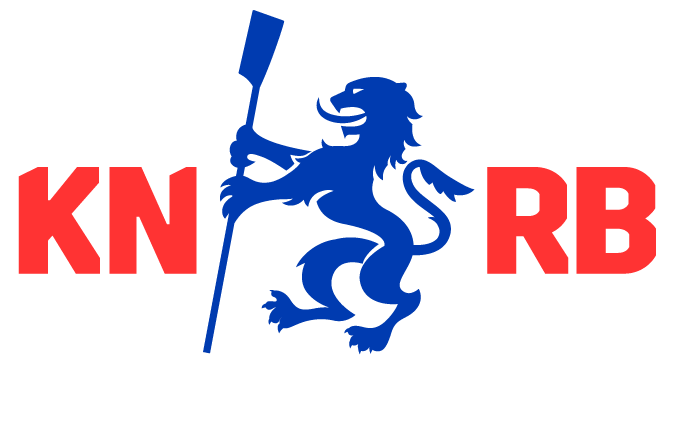

### Head of the River partners
<!-- 

  

    <h5>Hoofdpartners</h5>
    

      
    

    

      
    

        

      
    

        

      
    

        

      
    

  

 -->

  <h5>Partners</h5>
  

    

      
    

    

      
    

    

      
    

    

      
    

    

      
    

  

<!-- TODO -->

### Partnerschap

The Head of the River is een van de meest prestigueze roeievenementen in Nederland. Als officiele sponsor van de Head of the River raakt u betrokken bij een breed bezocht roeievenement met een grote verscheidenheid aan deelnemers en vrijwilligers.

<iframe style="position: absolute; top: 0; left: 0; right: 0; width: 100%; height: 100%; border: none;" src="https://www.youtube.com/embed/jfCe92a1UiM?si=l-EDQkqdZmqhIpYe" title="Njord wint de Head of the River 1949"  width="560" height="315" allowfullscreen="allowfullscreen" allow="accelerometer; clipboard-write; encrypted-media; gyroscope; picture-in-picture"></iframe>

{}

##### Overzicht

Lorem Ipsum is simply dummy text of the printing and typesetting industry. Lorem Ipsum has been the industry's standard dummy text ever since the 1500s.

##### Bestemming Amsterdam

Lorem Ipsum is simply dummy text of the printing and typesetting industry. Lorem Ipsum has been the industry's standard dummy text ever since the 1500s.

##### Marketing statistiek

###### Social Media

Onze (social)mediaplatformen groeien elk jaar weer. Ze bieden een breed publiek in verschillende leeftijdsgroepen. 

20.000 Unieke websitebezoeken   
3.000 Facebookvolgers    
20.000 Faceboekbereik    
1.500 Instagramvolgers   
150 LinkedInvolgers    
+15 landen vanwaar de website bezocht wordt  

<--->

##### Scholing

Lorem Ipsum is simply dummy text of the printing and typesetting industry. Lorem Ipsum has been the industry's standard dummy text ever since the 1500s.

##### Live videoregistratie

Lorem Ipsum is simply dummy text of the printing and typesetting industry. Lorem Ipsum has been the industry's standard dummy text ever since the 1500s.

{}

##### Demografie
{}  

###### Leeftijd

<!-- 

 -->

<--->

###### Herkomst
<!-- ///// Map ///// -->

  

  <body>
    

  </body>
<!-- ///// -->

<--->

###### Geslacht

  

{}

#### Partneropties

Pakketwaarde: €   
Pakketinhoud:
- Item 1
- Item 2
- Item 3
- Item 4





Pakketwaarde: €    
Pakketinhoud:
- Item 1
- Item 2
- Item 3





Pakketwaarde: €
Pakketinhoud:
- Item 1
- Item 2





Pakketwaarde: €
Pakketinhoud:
- Item 99





Uiteraard gaan we graag vrijblijvend met u in gesprek, ook als u een pakket op maat samen met ons wilt maken. Misschien wil u wel een combinatie van het bovenstaande of heeft u interesse in iets anders? 



#### Partnervideos

  

    

      

<iframe style="position: absolute; top: 0; left: 0; right: 0; width: 100%; height: 100%; border: none;" src="https://www.youtube.com/embed/jfCe92a1UiM?si=l-EDQkqdZmqhIpYe" title="Njord wint de Head of the River 1949"  width="560" height="315" allowfullscreen="allowfullscreen" allow="accelerometer; clipboard-write; encrypted-media; gyroscope; picture-in-picture"></iframe>

    

    

      

<iframe style="position: absolute; top: 0; left: 0; right: 0; width: 100%; height: 100%; border: none;" src="https://www.youtube.com/embed/6v1lJOwkx3g?si=WZGimHxiN9I9d0cm" title="Njord wint de Head of the River 1949"  width="560" height="315" allowfullscreen="allowfullscreen" allow="accelerometer; clipboard-write; encrypted-media; gyroscope; picture-in-picture"></iframe>

    

        

      

<iframe style="position: absolute; top: 0; left: 0; right: 0; width: 100%; height: 100%; border: none;" src="https://www.youtube.com/embed/OiSIrbpXx8k?si=da-797q-gSvS6N4g" title="Njord wint de Head of the River 1949"  width="560" height="315" allowfullscreen="allowfullscreen" allow="accelerometer; clipboard-write; encrypted-media; gyroscope; picture-in-picture"></iframe>

  

