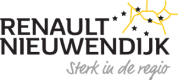

<!--  -->

<!-- Intro text -->

### Partnerschap

<!-- Partner video -->

<section id="sect_partnership" style="margin-top:-200px; padding-top:200px;">

  

    
<iframe style="position: absolute; top: 0; left: 0; right: 0; width: 100%; height: 100%; border: none;" src="https://www.youtube.com/embed/jfCe92a1UiM?si=l-EDQkqdZmqhIpYe" title="Njord wint de Head of the River 1949"  width="560" height="315" allowfullscreen="allowfullscreen" allow="accelerometer; clipboard-write; encrypted-media; gyroscope; picture-in-picture"></iframe>

  

</section>
Met de Head wordt het wedstrijdseizoen voor vieren en achten jaarlijks in Amsterdam geopend. Bijna 4000 deelnemers strijden begin maart in deze klassieker, die zich de oudste en grootste langebaanroeiwedstrijd van Nederland mag noemen. Met 500 ploegen en veel buitenlandse roeiers uit meer dan 10 landen is de Head een spannend begin van het roeiseizoen. Niet voor niets Dé lange afstandsklassieker van Nederland genoemd.
Omdat de Head wil groeien en professionaliseren, zijn we op zoek naar serieuze partners voor deze prominente wedstrijd.   

<!-- Als officiële partner van De Head kom je uitgebreid in beeld voorafgaand en tijdens de wedstrijd. Dit jaar (2025) zullen we de wedstrijd voor het eerst rechtstreeks uitzenden, zowel op  tv- als  online. Daarnaast wordt je ook betrokken bij een breed internationaal sportevenement met een grote verscheidenheid aan deelnemers en vrijwilligers.   -->

<!-- PDF presentation -->

<!-- 

  <h5>Partnermogelijkheden: <a href=../partners/documents/HeadPPT-Partners_2025.pdf>Presentatie</a></h5>

 -->

<!-- 

<iframe class="pdf"  style="position: absolute; top: 0; left: 0; right: 0; width: 100%; height: 100%; border: none;"
    src="documents/HeadPPT-Partners_2025.pdf">
  </iframe>

 -->

<!-- Two column information -->

{}

##### De Head

De Head of The River Amstel is het grootste roei-evenement van Nederland. Verdeeld over twee dagen roeien 4.000 deelnemers een tijdwedstrijd. De start bevindt zich in Ouderkerk aan de Amstel en de finish is bij roeivereniging KAR&ZV De Hoop in hartje Amsterdam. Het parcours is ongeveer acht kilometer lang en zeer bochtig. Dat maakt deze wedstrijd erg interessant voor de stuurmannen- en vrouwen. Er doen roeiers mee uit meer dan tien landen die uitkomen in meer dan twintig verschillende disciplines. De organisatie bestaat uit een organisatiecommissie en tientallen vrijwilligers. Roeivereniging Willem 3 en de Amsterdanse Roeibond zijn verantwoordelijk voor de organisatie van de wedstrijd. Daarnaast zijn alle roeiverenigingen langs de Amstel betrokken tijdens het wedstrijdweekend.     

##### Deelnemers

De Head is een tijdwedstrijd: roeiers strijden om de snelste te zijn in hun veld. Er worden diverse troffeen en ook de Blauwe Wimpel uitgereikt aan de winnaars. De wimpel is voor de snelste verenigingsacht. Op alle niveaus is er strijd, zowel voor de recreatieve roeier als de toproeiers met hun eigen (Olympische) record. Sinds 2 jaar is het spectaculaire Coastal Endurance aan het wedstrijdschema toegevoegd. Het laagdrempelige Coastal-roeien is wereldwijd één van de snelst groeiende disciplines binnen de roeisport en kenmerkt zich door roeien op open water, weinig regels en een massastart. ‘Coastal' is recent Olympisch geworden en deze discipline zal voor het eerst worden geroeid tijdens de Olympische Spelen van Los Angeles in 2028.

<--->

##### Marketing statistiek

###### (social) Media

Onze (social) mediaplatformen groeien elk jaar weer. Ze bieden een breed publiek in verschillende leeftijdsgroepen. 

-   20.000 Unieke websitebezoeken   
-   3.000 Facebookvolgers    
-   20.000 Faceboekbereik    
-   1.500 Instagramvolgers   
-   150 LinkedInvolgers    
-   \+15 landen vanwaar de website bezocht wordt  

##### Partners

De Head is op zoek naar partners: bedrijven of organisaties die ons én zichzelf willen versterken. Partner worden van onze roeiwedstrijd kan op allerlei manieren, maar bovenal ondersteunt uw organisatie hiermee sport, bewegen en vrijwilligerswerk. 

Partners komen op diverse manieren in beeld:

-   Voorafgaand aan de wedstrijd op verzchillende online- en offline uitingen
-   Op locatie, langs de wedstrijdbaan en op de vereningen langs de Amstel
<!-- -   Op de beoogde live tv-uitzending, die op 9 maart gepland staat bij de Publieke Omroep Amsterdam en daarbuiten. 
    Beoogde partners bieden wij verschillende pakketten aan, maar ook kunnen we met je een pakket op maat maken.   -->

<!-- ##### Live videoregistratie

In 2025 gaat De Head iets nieuws doen: we leggen onze wedstrijd vast op televisie. Het team van Salto Amsterdam is bereid gevonden om met ons een live-uitzending te maken die zes uur duurt. Beelden van de wedstrijd (zes camera's langs de kant en twee tot vier drones in de lucht) worden afgewisseld met studiogesprekken over de wedstrijd, het evenement en alles over de roeisport. Partners komen voor, tijdens en na de uitzending goed in beeld. Ook wordt de tv-registratie op online kanalen uitgezonden en doorgezet naar andere media. -->

{}

<!-- Demography graphs -->

##### Demografie

{}  

###### Leeftijd

<--->

###### Herkomst

<body>
  

</body>

<--->

###### Geslacht

  

{}

<!-- Accordion -->

#### Partneropties


Pakketwaarde: 15.000 tot 20.000 euro

-   Als partner zichtbaar voor en tijdens de wedstrijd en bij prijsuitreiking
-   Promotie van de partner op de website en sociale media
-   Mogelijkheid voor een eigen stand en/of werving (ook voor rekrutering werknemers)
-   Tv-registratie: lang vooraf en na afloop (en aan het begin van reclameblokken): 'Dit programma wordt mede mogelijk gemaakt door...' 
-   Alle andere vormen van zichtbaarheid in tv-registratie
-   Een eigen reclame in de reclameblokken van de zender (zelf aanleveren)
-   Mogelijkheid om naam aan beker te verbinden





Pakketwaarde: 10.000 tot 15.000 euro

-   Als partner zichtbaar op plekken voor en tijdens de wedstrijd en bij prijsuitreiking
-   Promotie van de partner op de website en sociale media
-   Mogelijkheid voor een eigen stand en/of werving (ook voor rekrutering werknemers)
-   Tv-registratie: kort vooraf en na afloop (en aan het begin van reclameblokken): 'Dit programma wordt mede mogelijk gemaakt door...' 
-   Alle andere vormen van zichtbaarheid in tv-registratie
-   Een eigen reclame in de reclameblokken van de zender (zelf aanleveren)





Pakketwaarde: 5.000 tot 10.000 euro

-   Promotie van de partner op de website en sociale media
-   Als partner zichtbaar op sommige plekken tijdens de wedstrijd en bij prijsuitreiking
-   Alle andere vormen van zichtbaarheid in tv-registratie
-   Een eigen reclame in de reclameblokken van de zender (zelf aanleveren)





Bedrijven uit de wereld van het roeien bieden we de gelegenheid hun product(en) te presenteren aan onze deelnemers op locatie.  
Voor meer informatie neem je vrijblijvend contact met ons op. ([info@headoftheriver.nl](mailto:info@headoftheriver.nl))





Uiteraard gaan we graag vrijblijvend met je in gesprek, ook als je een pakket op maat samen met ons wilt maken. Misschien wil je wel een combinatie van het bovenstaande of heb je interesse in iets anders? 




Voor bedrijven die geinteresseerd zijn in een introductie in roeien en willen bijdragen onze wedstrijd hebben bieden we een bedrijfsroeipakket.

-   2x les op de ergometers onder begeleiding van (oud-) toproeiers
-   3x les op water onder leiding van een (oud-)topcoach
-   Lezing door combinatie van (oud-) topsporters
-   Roeidiner (indien gewenst)
-   Deelnemen aan de Head of the River met een vier of een acht



<!-- Partner videos -->

#### Partnervideos

  

    

      

        
<iframe style="position: absolute; top: 0; left: 0; right: 0; width: 100%; height: 100%; border: none;" src="https://www.youtube.com/embed/jfCe92a1UiM?si=l-EDQkqdZmqhIpYe" title="Njord wint de Head of the River 1949"  width="560" height="315" allowfullscreen="allowfullscreen" allow="accelerometer; clipboard-write; encrypted-media; gyroscope; picture-in-picture"></iframe>

      

    

    

      

        
<iframe style="position: absolute; top: 0; left: 0; right: 0; width: 100%; height: 100%; border: none;" src="https://www.youtube.com/embed/6v1lJOwkx3g?si=WZGimHxiN9I9d0cm" title="Njord wint de Head of the River 1949"  width="560" height="315" allowfullscreen="allowfullscreen" allow="accelerometer; clipboard-write; encrypted-media; gyroscope; picture-in-picture"></iframe>

      

    

    

      

        
<iframe style="position: absolute; top: 0; left: 0; right: 0; width: 100%; height: 100%; border: none;" src="https://www.youtube.com/embed/OiSIrbpXx8k?si=da-797q-gSvS6N4g" title="Njord wint de Head of the River 1949"  width="560" height="315" allowfullscreen="allowfullscreen" allow="accelerometer; clipboard-write; encrypted-media; gyroscope; picture-in-picture"></iframe>

      

    

  

<!-- Partner overview grid -->

### Head of the River partners

<section id="sect_current_partners" style="margin-top:-200px; padding-top:200px;" >

  <h5>Partners</h5>
  

    <!-- 

      
    
 -->
    

      
    

    

      
    

    

      
    

  

</section>
