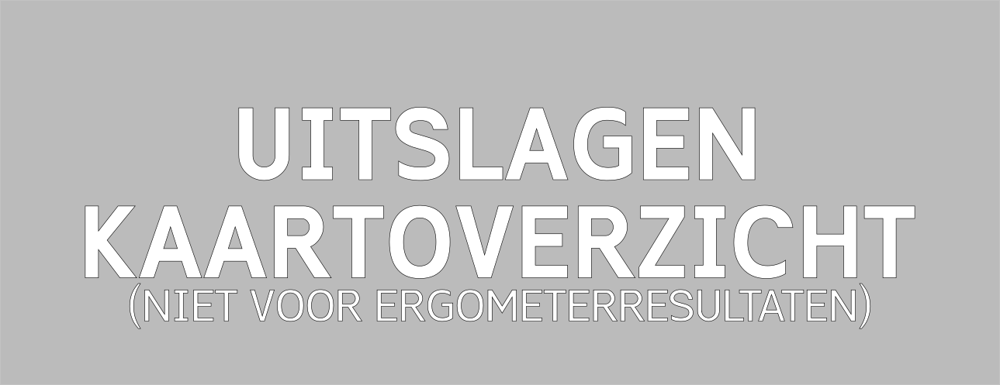

### Uitslagenarchief 
Hieronder vind je de uitslagen van de Head of the River Amstel van de afgelopen jaren.



De uitslagen van de Head of the River Amstel 2023 kan je vinden via onderstaande link.





De uitslagen van de Head of the River Amstel 2022 kan je vinden via onderstaande link.





Wegens COVID-19 is de Head of the River Amstel niet doorgegaan in 2021. 
Wel is in 2021 de Virtual Head of the River georganiseerd. Hieronder vind je de uitslagen van deze digitale variant van de Head of the River Amstel.

    

    
    

    

    
  





Wegens COVID-19 is de Head of the River Amstel niet doorgegaan in 2020





Vanwege slecht weer is zaterdag van de Head of the River Amstel niet doorgegaan in 2019. De zondag is er wel gevaren en kan je de uitslagen via de link hieronder vinden.




Vanwege vorst is de Head of the River Amstel niet doorgegaan in 2018
