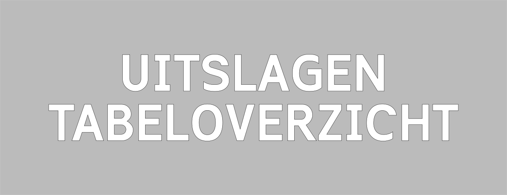

### Uitslagenarchief 
Hieronder vind je de uitslagen van de Head of the River Amstel van de afgelopen jaren.


<!-- TODO -->


De uitslagen van de Head of the River Amstel 2025 kan je vinden via onderstaande link.

De verdeling van de bekers en de wimpels vind je in de tabel hieronder.

| Prijs                 | Veld                  | Winnaar editie 2025        |
|-----------------------|-----------------------|---------------------------------|
| HEj8+                 | Mannen Eerstejaars 8+  | Nereus                       |
| DEj8+                 | Vrouwen Eerstejaars 8+  | Gyas                      |
| DM8+                  | Vrouwen Master 8+       | Beatrix      |
| M8+                   | Master 8+             | de Hoop / Proteus-Eretes / Okeanos |
| M16 4*                | Meisjes 16 Dubbel Vier   | Hemus / Spaarne  /Die Leythe   |
| M18 4*                | Meisjes 18 Dubbel Vier   | De Hunze / Amstel / Spaarne / Willem III  |
| J16 4*                | Jongens 16 Dubbel Vier   | Die Leythe / Tromp |
| J18 4*                | Jongens 18 Dubbel Vier   | Die Leythe / Willem III / de Hoop | 
| Blauwe Wimpel: HG 8+  | Mannen gevorderde acht | Aegir |
| Blauwe Wimpel: DG 8+  | Vrouwen gevorderde acht | Gyas |





De uitslagen van de Head of the River Amstel 2024 kan je vinden via onderstaande link.

De verdeling van de bekers en de wimpels vind je in de tabel hieronder.

| Prijs                 | Veld                  | Winnaar           |
|-----------------------|-----------------------|-------------------|
| HE8+                  | Heren Elite 8+        | A.A.S.R. Skoll    |
| DE8+                  | Dames Elite 8+        | -                 |
| HEj8+                 | Heren Eerstejaars 8+  | A.S.R. Nereus     |
| DEj8+                 | Dames Eerstejaars 8+  | A.G.S.R. Gyas     |
| DM8+                  | Dames Master 8+       | R.V. Willem III   |
| M8+                   | Master 8+             | A.U.S.R. Orca     |
| DCl4*                 | Dames Club 4*         | A.G.S.R. Gyas     |
| M16/M18 4*            | Meisjes Dubbel Vier   | Alkmaarsche R. & Z.V. & H.R.V. Cornelis Tromp         |
| J16/J18 4*            | Jongens Dubbel Vier   | L.R.Z.V. Die Leythe & R.V. DDS & K.R. & Z.V. De Maas  |
| Blauwe Wimpel: HCl8+  | Verenigingsacht Heren | A.A.S.R. Skoll    |
| Blauwe Wimpel: DCl8+  | Verenigingsacht Dames | -                 |





De uitslagen van de Head of the River Amstel 2023 kan je vinden via onderstaande link.





De uitslagen van de Head of the River Amstel 2022 kan je vinden via onderstaande link.





Wegens COVID-19 is de Head of the River Amstel niet doorgegaan in 2021. 
Wel is in 2021 de Virtual Head of the River georganiseerd. Hieronder vind je de uitslagen van deze digitale variant van de Head of the River Amstel.

    

    
    

    

    
  





Wegens COVID-19 is de Head of the River Amstel niet doorgegaan in 2020





Vanwege slecht weer is zaterdag van de Head of the River Amstel niet doorgegaan in 2019. De zondag is er wel gevaren en kan je de uitslagen via de link hieronder vinden.




Vanwege vorst is de Head of the River Amstel niet doorgegaan in 2018
